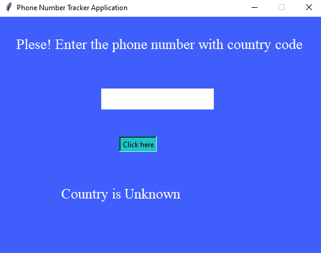
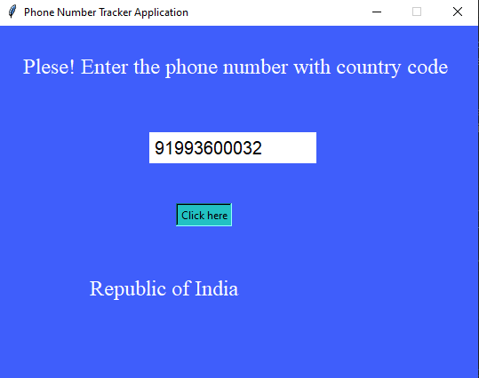
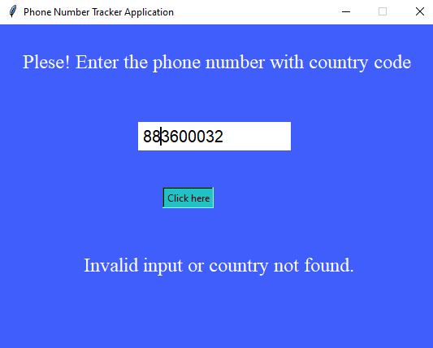

# Phone Number Tracker Application

<p align="justify"> ✍This application is a simple tool designed to track the country of a phone number using the `pycountry` and `phone_iso3166` libraries. It provides a basic GUI built with Tkinter, allowing users to enter a phone number (including its country code) and find out which country the number is from.</p>

## Features

- Simple and intuitive GUI for easy interaction.
- Enter a phone number with its country code to track its country.
- Utilizes `pycountry` for country information and `phone_iso3166` for mapping phone numbers to country codes.

## Prerequisites

Before running this application, ensure you have Python installed on your system. You will also need the `pycountry` and `phone_iso3166` packages. Install them using pip:

```bash
pip install pycountry phone_iso3166
```

## Running the Application
- Clone this repository or download the source code.
- Open a terminal or command prompt in the directory containing the application code.
- Run the application with Python:

```bash
python Your-file-name.py
```

### Usage
- Upon launching the application, you will see an input field where you can enter a phone number along with its country code.
- Click the "Click here" button after entering the phone number.
- The application will display the country associated with the entered phone number below the button.

## Built With
- Python - The programming language used.
- Tkinter - Python's standard GUI library.
- Pycountry - Used for country information.
- Phone_ISO3166 - For mapping phone numbers to country codes.

### Output Screen

- When you do not enter any number.
#### Empty
  

- When you enter the correct code with number.
#### Valid input
  


- When you enter the incorrect number.
#### Invalid input
  
